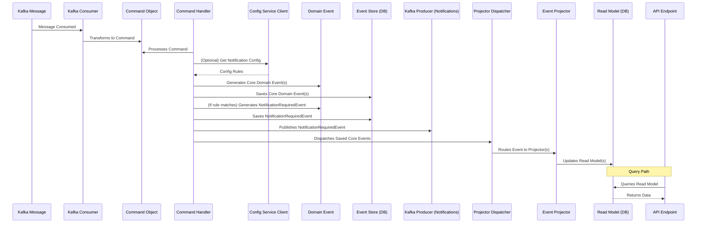

# Tutorial 2: CQRS and Event Sourcing Deep Dive

This tutorial explores two core architectural patterns used in the Case Management Microservice: Command Query Responsibility Segregation (CQRS) and Event Sourcing (ES). Understanding these patterns is crucial to grasping how the service processes data and maintains state.

## 1. What are CQRS and Event Sourcing?

### CQRS (Command Query Responsibility Segregation)

At its heart, CQRS is a pattern that separates the model for *writing* data (Commands) from the model for *reading* data (Queries).

*   **Commands:** Represent an intent to change the state of the system. They are imperative (e.g., `CreateCaseCommand`, `UpdateDocumentStatusCommand`). Commands are typically processed by handlers that execute business logic and may result in state changes. They usually don't return data, but rather an acknowledgment of success or failure (perhaps an ID of a created entity).
*   **Queries:** Represent a request to retrieve data from the system. They are descriptive and should not alter any state. Queries directly fetch data from optimized read models.

**Why use CQRS?**
*   **Scalability:** Read and write workloads are often different. Separating them allows scaling each side independently. For example, you might have many more reads than writes.
*   **Optimized Data Models:** You can design data models specifically for updates (often normalized, good for consistency) and other models specifically for queries (often denormalized, tailored for specific views, good for performance).
*   **Flexibility & Simplicity:** Each side (command or query) can be simpler because it only has one responsibility.
*   **Performance:** Read models can be highly optimized for query performance, while write models can be optimized for transactional consistency.

### Event Sourcing (ES)

Event Sourcing is a pattern where all changes to an application's state are stored as a sequence of immutable *domain events*. Instead of storing the current state of an entity directly, you store every event that has affected that entity.

*   **Domain Events:** Represent significant occurrences or facts within the business domain (e.g., `CaseCreatedEvent`, `DocumentStatusUpdatedEvent`). They are named in the past tense and capture *what happened*.
*   **Event Store:** A specialized database (or a regular database used in a specific way) that appends these events. Events are never deleted or updated, only added.
*   **Reconstructing State:** The current state of an entity (an "aggregate") can be reconstructed at any time by replaying its historical events in order.
*   **Read Models (Projections):** Separate read models are built by subscribing to the stream of domain events and projecting them into query-optimized data structures.

**Why use Event Sourcing?**
*   **Audit Trail:** The event log provides a complete, reliable audit trail of all changes to the system.
*   **Temporal Queries:** You can determine the state of an entity at any point in time.
*   **Debugging & Analysis:** Easier to understand how an entity reached its current state.
*   **Flexibility in Read Models:** You can create new read models or update existing ones by replaying events, without affecting the write side or the source of truth (the event store).
*   **Decoupling:** Services can react to domain events published by other services.

**CQRS and ES Together:**
CQRS and ES are often used together. The command side of CQRS typically involves validating commands, executing business logic, and producing domain events that are persisted using Event Sourcing. The query side then builds its read models by consuming these domain events. This is the approach taken in our microservice.

## 2. CQRS/ES in the Case Management Microservice

Let's see how these patterns are implemented in our project:

### a. Commands

*   **Definition:** Command Pydantic models are defined in `case_management_service/core/commands/models.py`.
    *   Example: `CreateCaseCommand`, `UpdateDocumentStatusCommand`.
    *   They inherit from a `BaseCommand` which might include common fields like a `command_id`.
    ```python
    # From core/commands/models.py
    class CreateCaseCommand(BaseCommand):
        client_id: str
        case_type: str
        case_version: str
        traitement_type: str # "KYC" or "KYB"
        persons: List[PersonData]
        company_profile: Optional[CompanyProfileData] = None
        beneficial_owners: Optional[List[BeneficialOwnerData]] = None
    ```

*   **Handling:** Command Handlers are located in `case_management_service/core/commands/handlers.py`.
    *   Example: `async def handle_create_case_command(command: CreateCaseCommand)`.
    *   Responsibilities of a handler:
        1.  Receive a command.
        2.  Perform validation (though some initial validation might happen at the API or message deserialization layer).
        3.  Execute core business logic. This might involve creating new aggregate IDs.
        4.  Generate one or more Domain Events representing the outcome of the command.
        5.  Persist these events to the Event Store.
        6.  Trigger any follow-up actions (like dispatching events to projectors or publishing events to Kafka for other services).
    ```python
    # Simplified snippet from core/commands/handlers.py
    async def handle_create_case_command(command: CreateCaseCommand) -> str:
        # ... (generate case_id, company_id if KYB) ...

        # Create Domain Events
        case_created_event = domain_event_models.CaseCreatedEvent(...)
        events_to_dispatch.append(case_created_event)
        await save_event(case_created_event) # Persist to Event Store

        if command.traitement_type == "KYB" and command.company_profile:
            company_created_event = domain_event_models.CompanyProfileCreatedEvent(...)
            events_to_dispatch.append(company_created_event)
            await save_event(company_created_event)

        # ... (create other events like PersonLinked, BOAdded) ...

        # Dispatch events for local projection and/or external notification
        for event_to_dispatch in events_to_dispatch:
            await dispatch_event_to_projectors(event_to_dispatch)

        # Potentially publish specific events (e.g., NotificationRequiredEvent) to Kafka
        # if notification_rule_applies:
        #     await kafka_producer.produce_message(notification_event)

        return case_id
    ```

### b. Domain Events

*   **Definition:** Domain Event Pydantic models are in `case_management_service/core/events/models.py`.
    *   Example: `CaseCreatedEvent`, `CompanyProfileCreatedEvent`, `DocumentStatusUpdatedEvent`.
    *   They inherit from `BaseEvent`, which includes common fields like `event_id`, `event_type`, `aggregate_id`, `timestamp`, `version`, and a typed `payload`.
    *   The `payload` itself is another Pydantic model specific to the event (e.g., `CaseCreatedEventPayload`).
    *   `payload_model_name` attribute is a hint used during deserialization from the event store.
    ```python
    # From core/events/models.py
    class CaseCreatedEventPayload(BaseModel):
        client_id: str
        case_type: str
        case_version: str
        traitement_type: str
        company_id: Optional[str] = None

    class CaseCreatedEvent(BaseEvent):
        event_type: str = "CaseCreated"
        payload: CaseCreatedEventPayload
        payload_model_name: str = "CaseCreatedEventPayload"
    ```

### c. Event Store

*   **Implementation:** The Event Store is responsible for persisting and retrieving domain events. In our service, this logic is in `case_management_service/infrastructure/database/event_store.py`.
*   **Storage Schema:** Events are stored in MongoDB in a collection (e.g., `domain_events`). The schema for stored events is `StoredEventDB` (now imported from `case_management_service.app.models`), where the event's Pydantic payload is serialized to a dictionary.
    ```python
    # Previously from infrastructure/database/schemas.py, now from app/models/stored_event_db.py
    class StoredEventDB(BaseModel):
        event_id: str = Field(default_factory=lambda: str(uuid.uuid4()))
        event_type: str
        aggregate_id: str
        timestamp: datetime.datetime = Field(default_factory=datetime.datetime.utcnow)
        version: int = 1
        payload: Dict[str, Any] # Stored as a dictionary
        metadata: StoredEventMetaData
    ```
*   **`save_event(event_data: domain_event_models.BaseEvent)`:**
    *   Takes a domain event object (which has a Pydantic model as its payload).
    *   Performs a basic optimistic concurrency check based on `aggregate_id` and `version`.
    *   Transforms the domain event into the `StoredEventDB` format (serializing its `payload` model to a dictionary).
    *   Inserts it into the MongoDB `domain_events` collection.
*   **`get_events_for_aggregate(aggregate_id: str)`:**
    *   Retrieves all `StoredEventDB` documents for a given `aggregate_id`, sorted by `version`.
    *   **Deserialization:** Crucially, it deserializes these stored documents back into specific domain event Pydantic objects (e.g., `CaseCreatedEvent`) with their correctly typed Pydantic payloads. This uses the `event_type` and `payload_model_name` hints. This function is vital for reconstructing aggregate state if needed, or for replaying events.

### d. Event Projectors (Updating Read Models)

*   **Definition:** Projectors are functions defined in `case_management_service/core/events/projectors.py`.
    *   Examples: `project_case_created`, `project_company_profile_created`.
*   **Purpose:** They listen to specific domain events (via the `dispatch_event_to_projectors` mechanism, which is called by command handlers after events are saved).
*   **Logic:** When a projector receives an event it's interested in, it updates one or more read models.
    *   It transforms data from the event payload into the schema of the target read model (e.g., `CaseManagementDB`, `CompanyProfileDB` from `case_management_service.app.models`).
    *   It calls functions from `infrastructure/database/read_models.py` (or specific stores like `document_requirements_store.py`) to perform the actual database update (e.g., `upsert_case_read_model`).
    ```python
    # Simplified snippet from core/events/projectors.py
    async def project_case_created(event: domain_event_models.CaseCreatedEvent):
        case_data_for_read_model = db_schemas.CaseManagementDB(
            id=event.aggregate_id, # case_id
            client_id=event.payload.client_id,
            # ... other fields from event.payload ...
            traitement_type=event.payload.traitement_type,
            company_id=event.payload.company_id
        )
        await read_model_ops.upsert_case_read_model(case_data_for_read_model)
    ```
*   **`EVENT_PROJECTORS` Map:** This dictionary maps event type strings to a list of projector functions that should handle them.

### e. Read Models

*   **Definition:** Pydantic schemas for read models are now in `case_management_service/app/models/`. You can import them like `from case_management_service.app.models import CaseManagementDB`.
    *   Examples: `CaseManagementDB`, `PersonDB`, `CompanyProfileDB`, `BeneficialOwnerDB`, `RequiredDocumentDB`.
*   **Storage:** Stored in separate MongoDB collections, optimized for querying.
*   **Access:**
    *   Updated by projectors.
    *   Queried by API endpoints (via functions in `infrastructure/database/read_models.py` or specific stores).

## 4. Flow Summary (Write & Read Paths)



This separation allows the write side (commands, events, event store) to be robust and serve as the source of truth, while the read side (projectors, read models) can be flexible and optimized for various query needs. Changes to read models or adding new ones typically only involve creating new projectors and replaying events, without affecting the write path.

This deep dive should give you a clearer picture of how CQRS and Event Sourcing are the backbone of our Case Management Microservice.

Proceed to: [**Tutorial 3: Kafka Integration: Consumer and Producer**](./03_kafka_integration_consumer_and_producer.md)
